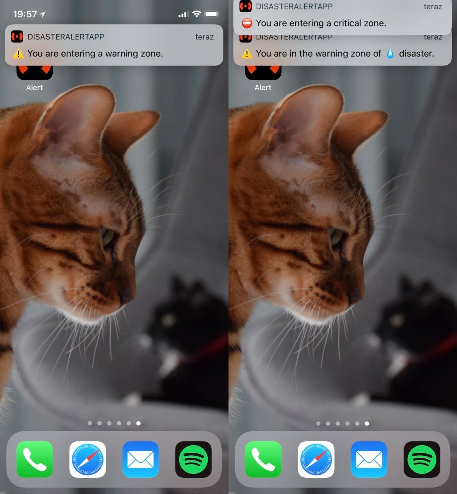

# Disaster alert

There is a network of IoT devices detecting natural disasters (fire, flood, earthquake, hurricane). People use a `Disaster Alert` application on their mobile phones, and receive immediate notifications if there are any critical situations in their area.

### Features:
- If there is a disaster, there are two areas "Critical" and "Warning":
	- Critical: should evacuate immediately.
	- Warning: small hazard. Should be careful in this area.
- A user can browse the map and check nearby disasters.
- A user receives notifications based on his current location.
 - Types of notifications:
	- Disaster starts, and the user is in the critical or warning area.
	- Disaster ends.
	- A user is moving and entering the critical or warning area.

### Technology stack:
- Watson IoT Platform
- Cloud Foundry Nodej.JS API
- Compose For Mongodb
- Push Notifications
- React Native

### Screenshots

