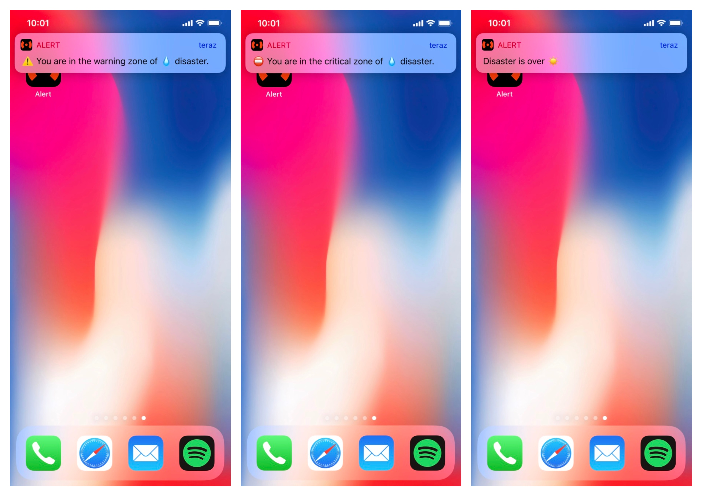
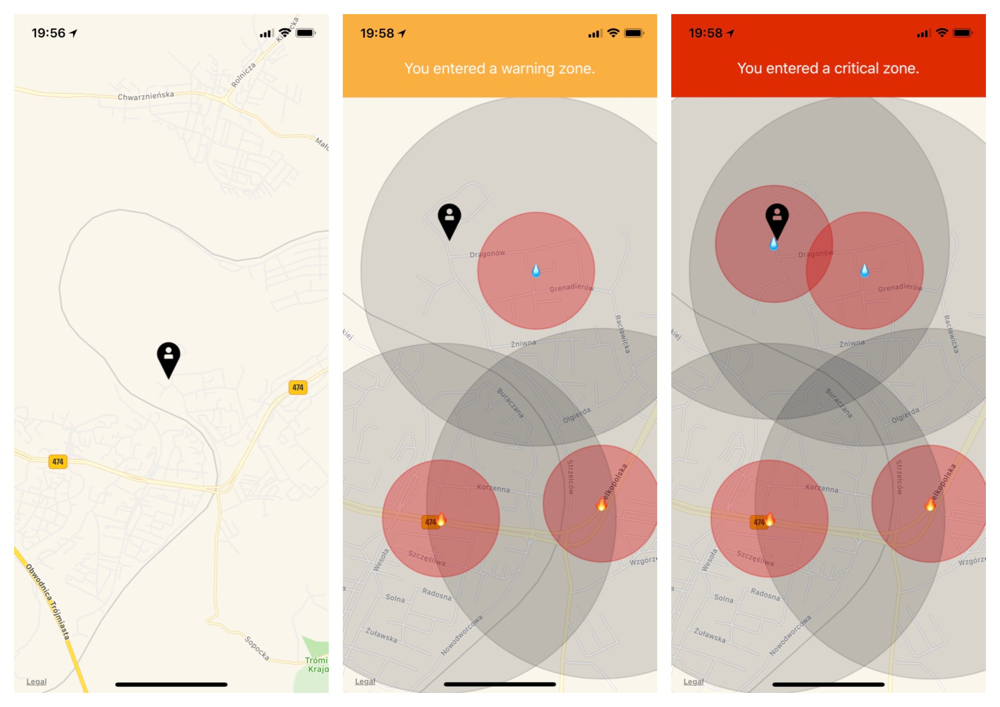
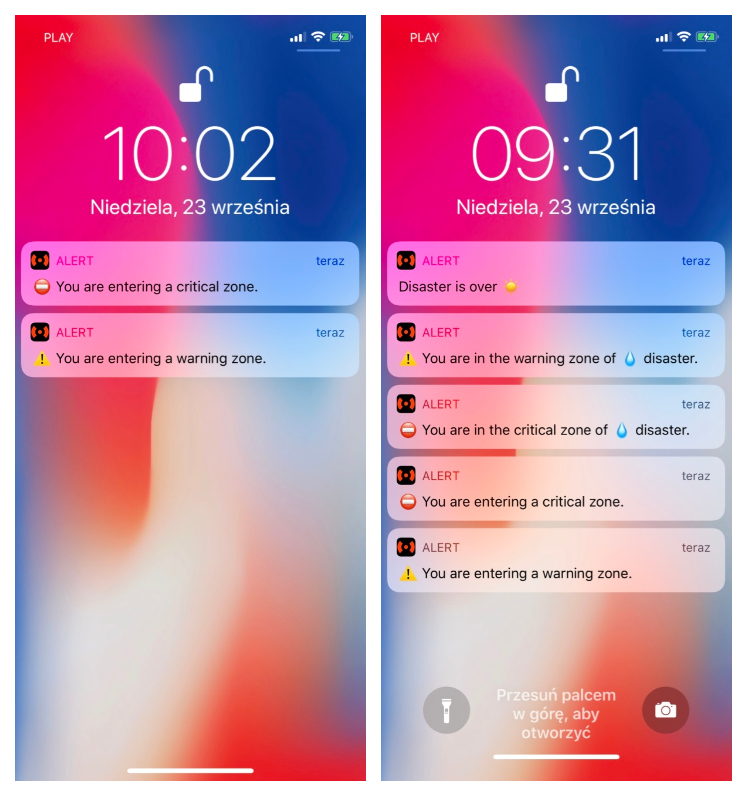
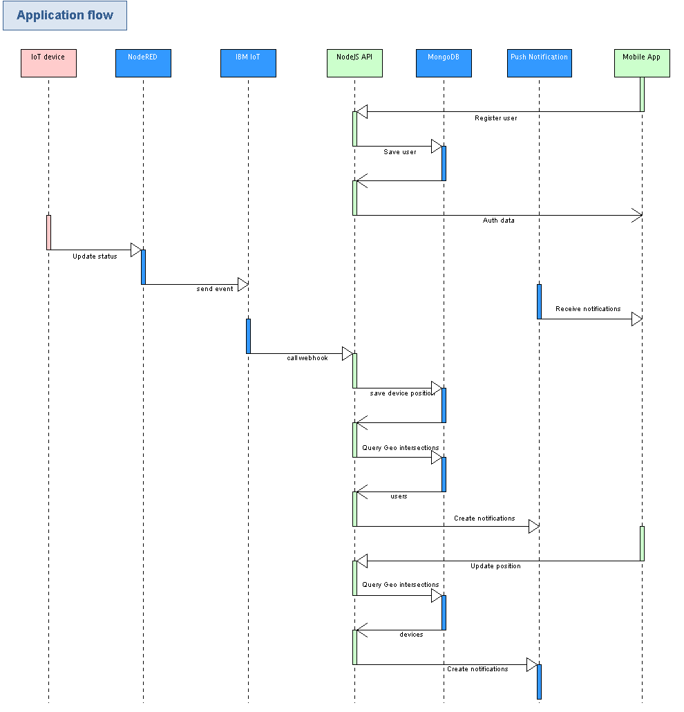

# Disaster alert

There is a network of IoT devices detecting natural disasters (fire, flood, earthquake, hurricane). People use a `Disaster Alert` application on their mobile phones, and receive immediate notifications if there are any critical situations in their area.

### Features:
- If there is a disaster, there are two areas "Critical" and "Warning":
	- Critical: should evacuate immediately.
	- Warning: small hazard. Should be careful in this area.
- A user can browse the map and check nearby disasters.
- A user receives notifications based on his current location.
 - Types of notifications:
	- Disaster starts, and the user is in the critical or warning area.
	- Disaster ends.
	- A user is moving and entering the critical or warning area.
- The application works in the background.
- The application is fully complete in 100% and ready to use in production.

### Technology stack:
- Watson IoT Platform
- Cloud Foundry Node.JS API
- Compose For Mongodb
- Push Notifications
- React Native (ios only)

### Screenshots

### Videos
- Demo 1 https://youtu.be/KA38lzY92XQ - New disaster starts in the current location.
- Demo 2 https://youtu.be/Auh0C734HS0 - Live locations tracking in the foreground.
- Demo 3 https://youtu.be/BgPw4Z0JQGU - Receiving notifications in the background.

### Application Flow
Mock IoT devices are configured in NodeRed.

Each device can send a normal value (alert will end) or critical value (alert will be created).  
Coordinates can be configured in a function `create data`.  
Then, `IBM IoT` node listens for all device events and invokes NodeJS API.  
NodeJS API handles all logic operations and pushes notifications. MongoDB is used for indexed geo locations queries. Thousands of users and devices can be handled.

Flow diagram

### Setup
- Check readme under `disaster-api` and `DisasterAlertApp`
- `node_red.txt` contains exported flow from NodeRed.
### Bluemix Setup
- Create "Watson IoT Platform" from the template (use [this tutorial](https://developer.ibm.com/tutorials/how-to-create-an-internet-of-things-platform-starter-application/)) and import node_red.txt. Change coordinates to match your location (`create data` function). Change API url in `bluemix` node (top right in the above screenshot). See this demo how to add more devices and change coordinates http://take.ms/Ad3bm.
- Create "Push Notifications" service using official readme. Setup only iOS.
- Create "Compose For Mongodb"
- Create "Cloud Foundry Node.JS" and link "Push Notifications" and  "Compose For Mongodb".
